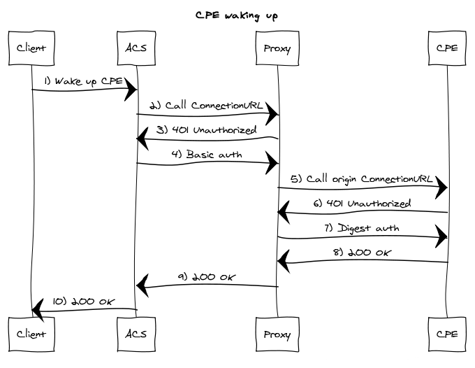

# cwmp-proxy
Integration of the proxy will provide you the ability to place CPEs and ACS servers in different networks. What about if the devices are placed in a private network (management VLAN)? We are forced to deploy our ACS servers in the same network which can break our system architecture or to introduce security issues.

The developers familiar with the CWMP protocol know that to wake up a concrete CPE, the ACS server should invoke the ConnectionRequestURL for that CPE. But how the ACS server will invoke the ConnectionRequestURL when the server and CPE are in different networks? There is no routing between them. The ACS server has routing only to the cwmp-proxy, so the acs should instruct the proxy to invoke the ConnectionRequestURL. 

Another important feature is the internal load balancing functionality that will distribute the incoming requests to the backend servers. The horizontal scaling will provide you ability to maintain unlimited number of devices. The requests are distributed with the help of round-robin algorithm.

### Communication

1. CPE sends a cwmp message to the cwmp-proxy. If the sent message contains a ConnectionRequestURL, it will be replaced with a proxy defined ConnectionRequestURL. For example: http://192.168.100.50:7547 will be replaced with http://127.0.0.1:8080/client?origin=http://192.168.100.50:7547, where 127.0.0.1:8080 is the proxy endpoint.

2. The proxy server distributes the modified cwmp message to the next backend server from the round-robin circular queue. 

### CPE Wake up

1. Administrator sends request to wake up a concrete CPE.
2. The ACS calls the proxy based ConnectionRequestURL (e.g. http://localhost/client?origin=http://8.8.8.8:7547)
3. The cwmp-proxy responds with 401 Unauthorized status code requesting Basic authentication.
4. The ACS attaches the Basic auth credentials and sends the request again.
5. The cwmp-proxy calls the origin ConnectionRequestURL attached as query parameter.
6. The CPE responds with 401 Unauthorized status code requesting Digest authentication.
7. The cwmp-proxy attaches the Digest auth credentials and sends the request again.
8. The CPE responds to cwmp-proxy with 200 OK status code.
9. The cwmp-proxy responds to ACS with 200 OK status code.
10. And in the end the ACS responds to the administrator with 200 OK status code.
